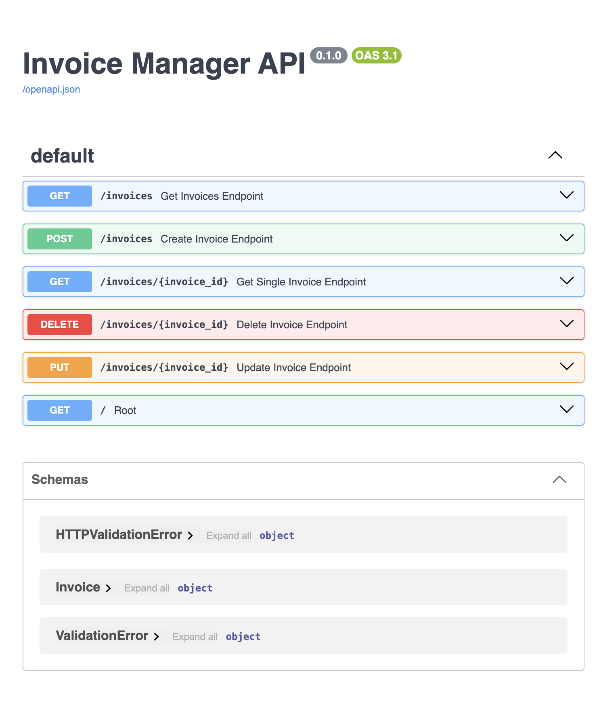

# Invoice Manager API

A FastAPI CRUD API that validates invoices with Pydantic and stores them in
`data/invoices.json`.

## Setup and run

From the repository root, create and activate a virtual environment, then
install the project's dependencies:

```bash
python3 -m venv .venv
source .venv/bin/activate
pip install -r requirements.txt
cd invoicecrudOperation
uvicorn main:app --reload
```

The API is available at <http://127.0.0.1:8000>. Interactive Swagger
documentation is at <http://127.0.0.1:8000/docs>; the OpenAPI schema is at
<http://127.0.0.1:8000/openapi.json>.

## Invoice data

Each invoice has the following required fields:

| Field | Type | Description |
| --- | --- | --- |
| `invoice_id` | string | Invoice identifier |
| `vendor` | string | Vendor name |
| `amount` | number | Invoice amount |
| `status` | string | Invoice status |

Pydantic validates the request body. Created and updated invoices are persisted
to `data/invoices.json`.

## API endpoints

| Method | Path | Behavior |
| --- | --- | --- |
| `GET` | `/invoices` | Return all invoices |
| `GET` | `/invoices/{id}` | Return the invoice with the matching `invoice_id` |
| `POST` | `/invoices` | Create and persist an invoice |
| `PUT` | `/invoices/{id}` | Replace and persist an invoice |
| `DELETE` | `/invoices/{id}` | Delete an invoice |

Requests for an invoice ID that does not exist return `404 Not Found`.
For `PUT`, the path ID is authoritative and is used as the saved invoice ID.

## Sample request and response

Create an invoice with `POST /invoices`:

```json
{
  "invoice_id": "INV-107",
  "vendor": "Example Supplies",
  "amount": 1250.5,
  "status": "PENDING"
}
```

Example response:

```json
{
  "message": "Invoice created successfully",
  "data": {
    "invoice_id": "INV-107",
    "vendor": "Example Supplies",
    "amount": 1250.5,
    "status": "PENDING"
  }
}
```

## Swagger evidence


